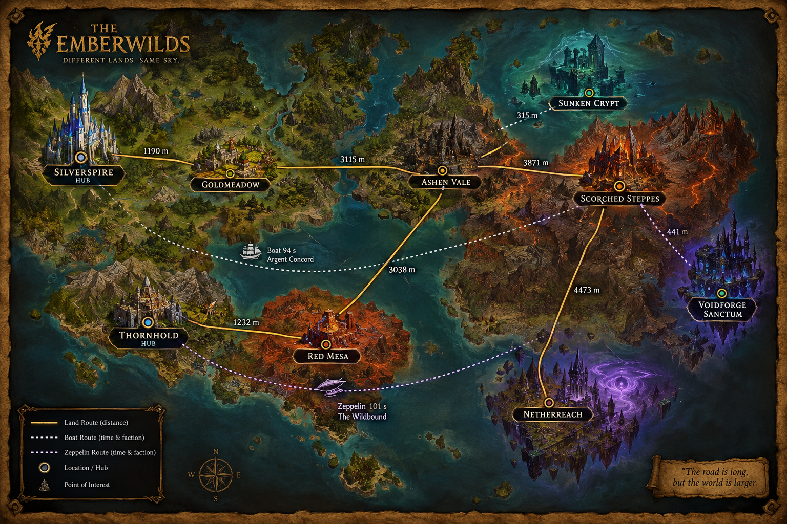
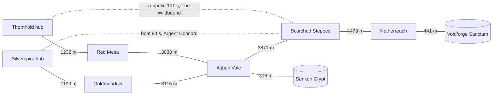

# Eternal Realms - Game Mechanics Reference

This document is the authoritative description of how Eternal Realms works. When the data
disagrees with this document, the data is wrong or something happened that the game does not
allow. Numeric reference values (zones, distances, creatures, loot tables, items, XP thresholds,
transports) live in the reference tables of the snapshot database and are equally authoritative.

## 1. World

- All event timestamps are server time, UTC.
- The game runs on a single realm. All characters can meet each other.
- There are two factions: **Argent Concord** and **The Wildbound**.
- An account can own characters in both factions. Characters never change faction.

### 1.1 Zones

- The world is divided into zones. Each zone is divided into sub-zones. Sub-zones describe
  where a character is inside a zone. Transports depart from and arrive at specific sub-zones.
- Each faction has one **capital hub**: Silverspire (Argent Concord) and Thornhold
  (The Wildbound). Hubs are safe: no combat of any kind happens in a hub.
- Each faction has its own starting zones (levels 1 to 20). All other zones are contested and
  open to both factions.
- Each zone has a recommended level range. Nothing prevents a character from entering any zone.
- Dungeons are zones. A dungeon connects to exactly one open-world zone.

### 1.2 World map (game version 2.0)

| Zone | Type | Faction | Levels | Connects to |
|---|---|---|---|---|
| Silverspire | Capital hub | Argent Concord | any | Goldmeadow |
| Thornhold | Capital hub | The Wildbound | any | Red Mesa |
| Goldmeadow | Starting zone | Argent Concord | 1 to 20 | Silverspire, Ashen Vale |
| Red Mesa | Starting zone | The Wildbound | 1 to 20 | Thornhold, Ashen Vale |
| Ashen Vale | Contested | both | 21 to 40 | Goldmeadow, Red Mesa, Scorched Steppes, Sunken Crypt |
| Scorched Steppes | Contested | both | 41 to 60 | Ashen Vale, Netherreach |
| Netherreach | Contested | both | 61 to 70 | Scorched Steppes, Voidforge Sanctum |
| Sunken Crypt | Dungeon | both | 30 to 35 | Ashen Vale |
| Voidforge Sanctum | Dungeon | both | 70 | Netherreach |

#### Map Diagram

Solid lines are walking corridors with minimum walking distance. Dotted lines are transports
with travel time. Distances are symmetric. Patch 2.1 adds one route; see the patch notes.

Voidforge Sanctum's final boss is **Archon Vexmoor**.

## 2. Characters

### 2.1 Classes

Nine classes, all available to both factions:

Warrior, Paladin, Hunter, Rogue, Priest, Shaman, Mage, Warlock, Druid.

Races exist for flavor and are not recorded in the data.

### 2.2 Levels and experience

- Levels run from 1 to 70. Level 70 is the cap.
- Each level requires a fixed amount of experience (XP). Thresholds are in the XP reference table.
- The only XP source is killing creatures. Each creature grants a fixed XP amount, listed in the
  creature reference table. There are no XP modifiers of any kind.
- Every XP award is an event. Reaching a threshold produces a level-up event.
- In a party, every member present at the kill receives the full creature XP (see 5.5).
- Characters at level 70 receive no XP.
- PVP grants no XP.

### 2.3 Health

Maximum health = 100 + 50 x level + 2 x gear score. Health is fully restored on respawn.
Out of combat, health regenerates to full; regeneration is not logged.

## 3. Movement

There are no mounts and no travel spells. Characters move in three ways only.

### 3.1 Walking

- All characters walk at the same speed: 7 meters per second.
- Zones connect through corridors. The zone adjacency table lists every connected pair and the
  minimum walking distance, in meters, between entering one zone and entering the next.
- Walking directly between two zones that are not adjacent is impossible.
- Entering and leaving zones and sub-zones produces events.

### 3.2 Amulet of the Planes

Every character owns exactly one Amulet of the Planes. It is granted when the character is
created; no loot event is recorded for it.

- It always returns the character to their faction's capital hub. No other destination.
- It has a 10 second channel.  It then goes on a 60 minute cooldown.
- Using it produces this event chain, in order:
  1. cooldown check
  2. item used
  3. item enters cooldown
  4. location change (arrival in hub)
- The amulet is soulbound from creation. It cannot be traded, auctioned, sold, or destroyed.

### 3.3 Transports

- Transports (boats, zeppelins, portals) run on fixed routes with fixed travel times, listed in
  the transport reference table.
- Each transport is available to one faction or to both, as listed in the table.
- Each transport departs from one sub-zone and arrives at one sub-zone, as listed in the table.
- Using a transport produces this event chain, in order:
  1. character interacts with the transport
  2. location change
  3. character exits the transport at the destination

### 3.4 Death and respawn

- A character who dies respawns at their faction's capital hub.
- Respawn can happen immediately after death.
- There is no death penalty of any kind.

### 3.5 Sessions

- Logging in and out produces events.
- A character logs in at the location where they logged out.

## 4. Items

The game has only three kinds of possession: **gear**, **gold**, and the **Amulet of the Planes**.

### 4.1 Gear

- Gear slots: **helmet**, **chest**, **pants**, **weapon**. One item per slot.
- Every gear item template has: slot, rarity, item level, level requirement, allowed classes,
  fixed merchant sell price, and (weapons) weapon type or (armor) armor type.
- Rarities: common, uncommon, rare, epic, legendary.
- A character can equip an item only if their class is in the item's allowed classes and their
  level is at or above the item's level requirement.
- Each physical item has a unique **item instance ID** for its whole life, from the moment it
  enters the world until it is sold to a merchant.
- Equipping an item produces 2 events: an unequip event for the item already in that slot (if
  any) and an equip event for the new item.

All weapons are one-handed. Weapon types and class proficiencies (TBC style, single weapon slot):

| Class | Allowed weapon types |
|---|---|
| Warrior | Sword, Axe, Mace, Dagger, Fist Weapon, Polearm, Staff, Bow, Gun, Crossbow |
| Paladin | Sword, Axe, Mace, Polearm |
| Hunter | Sword, Axe, Dagger, Fist Weapon, Polearm, Staff, Bow, Gun, Crossbow |
| Rogue | Sword, Mace, Dagger, Fist Weapon, Bow, Gun, Crossbow |
| Priest | Mace, Dagger, Staff, Wand |
| Shaman | Axe, Mace, Dagger, Fist Weapon, Staff |
| Mage | Sword, Dagger, Staff, Wand |
| Warlock | Sword, Dagger, Staff, Wand |
| Druid | Mace, Dagger, Fist Weapon, Polearm, Staff |

Armor follows the usual convention (cloth: Mage, Priest, Warlock; leather: Rogue, Druid;
mail: Hunter, Shaman; plate: Warrior, Paladin). The item's allowed-classes list is
authoritative.

### 4.2 Gear score

- Gear score = sum of the item levels of the equipped items.
- Gear score is capped per 10-level bracket (1 to 10, 11 to 20, ... 61 to 70). Caps are in the
  gear score reference table.

### 4.3 Binding

- All gear is **bind on equip**. An item that has never been equipped can be traded and auctioned.
- The first time an item is equipped it becomes **soulbound** to that character. Soulbound is a
  flag on the item instance; it produces no event of its own.
- A soulbound item can be equipped, unequipped, and sold to a merchant. It can never be traded
  or auctioned.

### 4.4 Inventory

- Each character has an inventory holding gear, gold, and their amulet. Current inventory is in
  the state tables of the snapshot.
- Every inventory change is an event: loot, equip, unequip, trade, auction, sale.
- An item instance is held by exactly one character (or held in escrow by the auction house) at
  any moment.

## 5. Combat

### 5.1 Attacks and abilities

- Every attack is either a **spell** or a **weapon attack**. There is no unarmed combat.
- Each class has a fixed set of abilities, listed in the ability reference table with attack
  type, base damage per level, and cooldown.
- Using any ability triggers a 1.5 second global cooldown, during which no other ability can be
  used. The global cooldown produces no events.
- Abilities with their own cooldown produce a cooldown start event and a cooldown end event,
  in the same event stream as every other character event.
- Every attack hits. There are no misses, dodges, blocks, buffs, or debuffs.

### 5.2 Damage

- Hit damage = (ability base damage for the character's level + 0.5 x gear score), varied by
  plus or minus 10 percent.
- **Critical hits** double the damage of the hit. Nothing else modifies damage.
- There is no damage mitigation of any kind (armor or resistances).
- All damage is of a single kind; there are no damage schools.
- Each class has a fixed critical hit chance, listed in the class reference table.
- Bosses cannot be critically hit.
- Creature hit damage = creature base damage x creature damage modifier. Creatures attack every
  2 seconds and never crit.
- Creature damage modifier by rank: normal 1.0, elite 1.5, boss 2.5.

### 5.3 PVE (player versus creature)

- A PVE encounter is one fight between one player, or one party, and one creature.
- Every encounter has an **encounter ID**. All events of that fight (start, outcome, damage,
  loot, XP) carry it.
- Events are recorded per player, even in a party.
- Normal creatures are logged as:
  1. encounter start: player, creature, zone, sub-zone, timestamp
  2. encounter end: outcome (victory, death, escaped, or enemy escaped), timestamp
  3. damage summary per player: damage done and damage received, by source and attack type
- **Bosses** are logged hit by hit, like PVP (see 5.4).
- Creatures never escape a fight.
- Creature data (ID, name, level, type, rank, total health, base damage, damage modifier, XP,
  loot table) is in the creature reference table.

### 5.4 PVP (player versus player)

- PVP happens only between characters of opposite factions, only in contested zones.
- PVP is logged hit by hit for every participant: attacker, target, ability, attack type,
  damage done, damage received, ability trigger, cooldown start and end.
- Most PVP fights are one on one. Group fights happen but are rare.
- PVP grants no XP and no loot. A character killed in PVP respawns at their hub.

### 5.5 Escaping a fight

- A character can escape (disengage from) a fight at any time. Escaping has no cost and no
  cooldown.
- The fight ends for the character who escaped, with outcome **escaped**. The fight continues
  for everyone still in it.
- A fight ends for the remaining side with outcome **enemy escaped** when every opponent has
  escaped. In PVE, the creature then returns to full health and grants nothing.
- A character who escaped before the kill is not present at the kill: no XP, no gold, and no
  loot assignment for that fight.

### 5.6 Parties

- Up to 5 characters of the same faction form a party.
- Joining and leaving a party is logged. Current and past party memberships, with join and leave
  times, are in the party state tables.

## 6. Loot

- When a creature dies, its loot table is rolled once. Item entries have a fixed drop chance.
  Gold entries give a fixed amount with a fixed chance.
- Drop chances are exact and published in the loot table reference data.
- **Drop**: each item that drops is an `item_dropped` event carrying the encounter ID and a new
  item instance ID. The item instance exists from this moment.
- In a party, each dropped item is assigned to one member chosen at random. Only the assigned
  member can loot it. Characters outside the encounter cannot loot it.
- **Loot**: picking up a dropped item is an `item_looted` event carrying the encounter ID and the
  item instance ID. The item enters the looter's inventory. Most items are looted immediately
  after dropping.
- Dropped items nobody loots disappear once players leave the area. No event is recorded.
- **Gold** is never dropped. When a gold entry rolls, every party member present receives the
  full amount immediately, the same way as XP, as a gold credit event.

## 7. Economy

### 7.1 Merchants

- Merchants buy gear at the item's fixed sell price. Merchants have unlimited gold.
- Merchants sell nothing.
- A sold item instance leaves the game permanently.

### 7.2 Trade

- Two characters can trade gear and gold directly.
- Trading is only possible between characters of the same faction who are in the same zone at
  the same time.
- A trade is atomic: both sides of a trade complete together or not at all.

### 7.3 Auction house

- Each faction has its own auction house, located in its capital hub.
- Creating or buying an auction requires being in the hub.
- Auctions are buyout only. Creating an auction moves the item into auction house escrow.
- On sale, the buyer pays the buyout price; the seller receives it minus a 5 percent cut.
- Unsold auctions expire after 48 hours and the item returns to the seller.

## 8. Game versions

The game version active at each moment is recorded on every event. A version update was
released during the snapshot window; see the patch notes.

---

# Patch Notes - Eternal Realms 2.1

Released on a Wednesday during the snapshot window (date in the version reference table).

**New content**
- New gear items dropped by Archon Vexmoor. See the item reference table.
- New teleporter: the **Netherreach Waygate** connects Ashen Vale and Netherreach, open to both
  factions. Travel time is in the transport reference table.

**Balance**
- Increased drop chances for **Archon Vexmoor**, final boss of Voidforge Sanctum. See the loot
  table reference data.

**Combat log**
- PVP hit events now record whether a hit was a critical hit. Critical hits existed before this
  patch but were not labeled in the log.

---

# Patch Notes - Eternal Realms 2.1

Released on a Wednesday during the snapshot window (date in the version reference table).

**New content**
- New gear items dropped by Archon Vexmoor. See the item reference table.
- New teleporter: the **Netherreach Waygate** connects Ashen Vale and Netherreach, open to both
  factions. Travel time is in the transport reference table.

**Balance**
- Increased drop chances for **Archon Vexmoor**, final boss of Voidforge Sanctum. See the loot
  table reference data.

**Combat log**
- PVP hit events now record whether a hit was a critical hit. Critical hits existed before this
  patch but were not labeled in the log.

